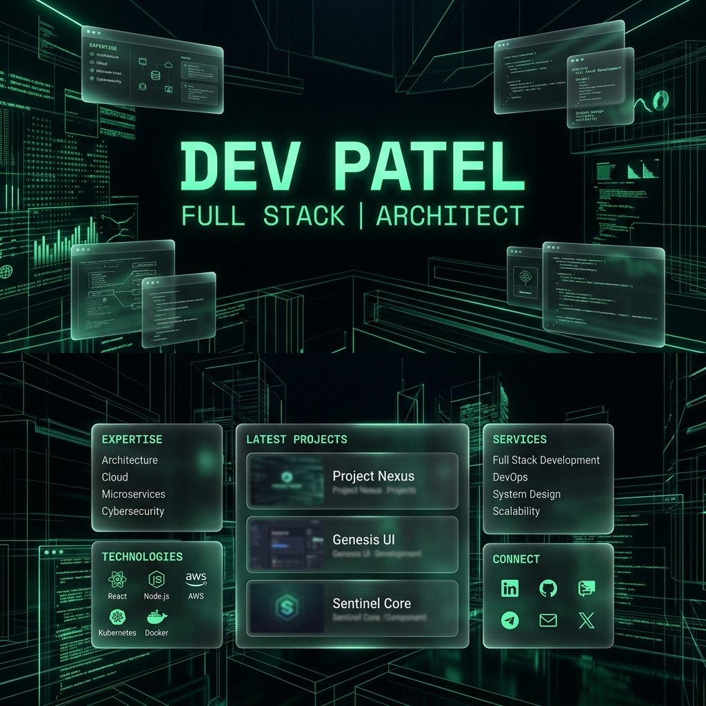
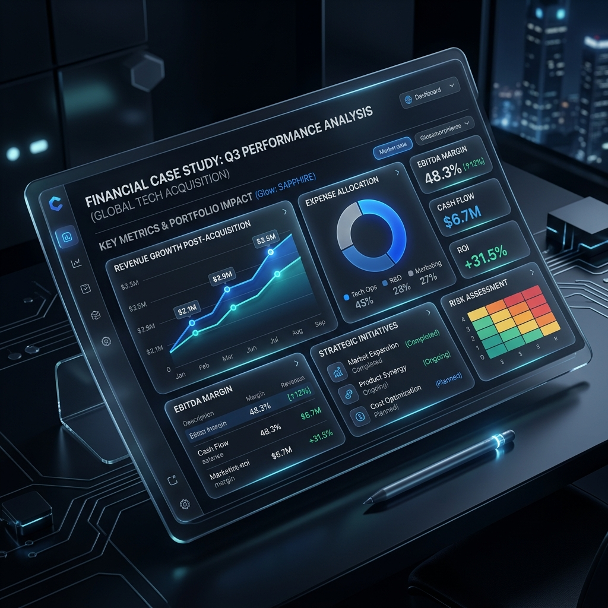

# 🌌 Cyber-Luxe Architectural Portfolio



## ⚡ Engineering at the Intersection of Logic & Aesthetics

Welcome to my high-density, editorial-style professional portfolio. This project is a manifesto of **Cyber-Luxe** design—a fusion of deep obsidian aesthetics, glowing architectural accents, and mission-critical engineering principles.

### 🏛️ The Vision
Built for the modern web, this portfolio prioritizes **information density** and **visual excellence**. It is designed to showcase complex full-stack architectures and professional trajectories within the high-stakes BFSI (Banking, Financial Services, and Insurance) ecosystem.

---

## 🚀 Technological Foundation

- **Core Framework**: [Next.js 15+](https://nextjs.org/) (App Router)
- **Styling Engine**: [Tailwind CSS v4](https://tailwindcss.com/)
- **Animation Orchestration**: [Framer Motion](https://www.framer.com/motion/)
- **Smooth Interaction**: [Lenis Scroll](https://github.com/darkroomengineering/lenis)
- **Identity Artifacts**: Custom Lucide-react Iconography
- **Typography**: Space Grotesk & Inter (Premium Editorial Stack)

---

## 💎 Core Features

### 1. High-Density Editorial UI
A systematic reduction of whitespace combined with high-fidelity glassmorphism creates a professional, data-rich experience that feels like a premium technical journal.

### 2. Interactive Identity Modules
- **Dynamic Case Studies**: Deep-dives into technical architecture with unified scrollable modals.
- **Architectural Chronicle**: A high-impact timeline of professional growth and engineering contributions.
- **Capability Ecosystem**: A modular grid showcasing a multi-disciplinary technical stack.

### 3. Precision Engineering
- **Body Scroll Locking**: Sophisticated overlay management for seamless navigation.
- **Theme Dynamics**: Real-time theme reveal animations and multi-color identity synchronization.
- **Responsive Integrity**: Optimized for all viewports, from ultra-wide monitors to high-density mobile displays.

---

## 🛠️ Case Study Deep-Dives



Each project is presented as a mission-critical challenge, detailing:
- **Technological Foundation**: The underlying stack.
- **Mission Critical Challenge**: The core problem solved.
- **Engineering Strategy**: The architectural solution.
- **Business Quantum Leap**: The measurable impact.

---

## ⚙️ Installation & Setup

Ensure you have [Node.js](https://nodejs.org/) and [pnpm](https://pnpm.io/) installed.

1. **Clone the repository**:
   ```bash
   git clone https://github.com/your-username/dev-portfolio.git
   cd dev-portfolio
   ```

2. **Install dependencies**:
   ```bash
   pnpm install
   ```

3. **Run the development server**:
   ```bash
   pnpm dev
   ```

4. **Build for production**:
   ```bash
   pnpm build
   ```

---

## 📬 Connectivity

Interested in strategic collaborations or architectural consulting?

- **LinkedIn**: [dev-patel-n](https://www.linkedin.com/in/dev-patel-n/)
- **GitHub**: [patel-dev-4](https://github.com/patel-dev-4)
- **Email**: [pateldev6622@gmail.com](mailto:pateldev6622@gmail.com)

---

<p align="center">
  <i>"Craft. Code. Conquer."</i>
</p>
